# Megatron 2

**高效地训练大模型的挑战**

1. 不可能把一个大模型放在一个多GPU服务器上
2. 需要的计算操作数会导致不切实际的训练时间

**在GPU集群上高效训练模型需要**

1. 高效内核实现：使大多数计算成为compute-bound而不是memory-bound
2. 设备间计算图的智能切割：降低通信量
3. 降低设备空转时间
4. 特定领域的通信优化
5. 优秀的硬件

## Contribution

1. PTD-P（inter-node pipeline par- allelism, intra-node tensor parallelism, and data parallelism）怎样融合起来去达到更高的累积吞吐量（给定batch size，并且在严格的optimizer semantics）
2. 与各种并行度相关的各种权衡
3. 各种并行之间如何相互交互
4. 提出一种交错流水线调度，可以将吞吐量提高10%，内存占用与现有方法相当

**分布式训练的指导性原则**

1. 不同形式的并行化会有不同的影响：并行化策略会影响通信量、内核执行的计算效率、流水线刷新带来的空转时间。在单个服务器内，TP比较高效；PP适用于比较大的模型。
2. PP的不同调度会影响通信量、流水线bubble大小和存储激活的内存大小。
3. 超参数会影响内存占用、内核执行的计算效率和流水线bubble大小。
4. 分布式训练是communication- intensive（通讯密集型）。

这篇文章，没有搜索并行化策略空间，而是使用启发式，也很有效。

## Related Work

### **data parallelism**

**DP有好的scale efficiency，但有两个限制（DP的batch size是固定的）：**

1. 设备超过一定数，每个设备的batch size太小，会降低GPU计算时的利用率，同时会增加通信消耗
2. 最多的设备数量是batch size，限制了训练时可以使用的设备数量

### **tensor parallelism**

**使用TP，大模型需要的多个多GPU服务器间切割模型，会带来两个问题：**

1. 在服务器间使用all_reduce通信，会有很慢的通信速度
2. 在TP并行度比较高时，每个设备都做小的矩阵乘法，会降低GPU的利用率

### **pipeline parallelism**

​	不同的层分配和调度策略（前向传播和反向传播如何调度）会有不同的性能权衡。不管是哪种调度，为了保持严格的optimizer semantics，优化步需要在每个设备间同步，这个就会导致在每个batch结束时进行pipeline flush，这会降低计算吞吐量。micro batch数和pipeline size的比例越大，pipeline flush的时间越少，所以通常会有一个较大的micro batch数。

​	一个batch会被分成多个小的micro batch，在多个micro batch间流水线执行前向传播和反向传播，为了保持严格的optimizer semantics，就需要周期性的流水线刷新。在每个batch的开始和结束，设备处于空转状态，把这个空转时间成为pipeline bubble。一些异步和bounded- staleness方法没有流水线刷新，但是弱化了权重更新semantic，这不在本文讨论范围内。

#### Schedule

t~pb~ : pipeline bubble	m : the number of microbatches	p : the number of pipeline stages

t~id~ : the ideal(perfect) time per iteration	t~f~   t~b~  : the time to execute a single microbatch’s forward and backwardpass

**Default Schedule**

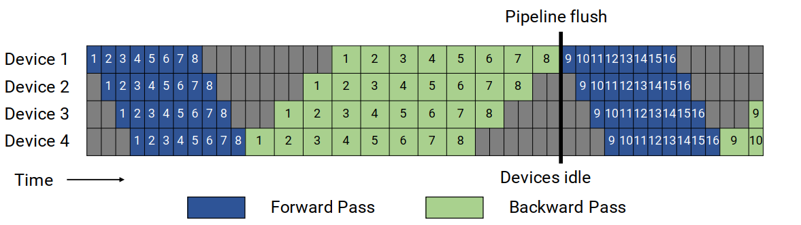

GPipe Schedule

$t_{pb} = (p - 1) * (t_f + t_b)$

$t_{id} = m * (t_f + t_b)$

Bubble  time fraction(pipeline bubble size)$ = \frac{t_{pb}}{t_{id}} = \frac{p - 1}{m}$

为了使bubble time变小，m需要变大，这会导致更高的内存占用，需要保存m个micro batch的中间激活。

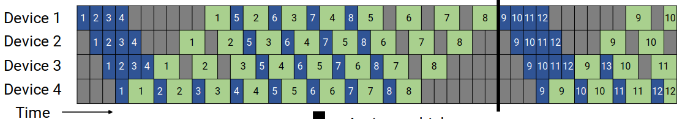

PipeDream-Flush Schedule

​	首先进入warm-up phase（每个进程执行不同数量的前向传播），这种调度方式会将正在执行（反向传播还没有执行，需要保存相关的激活值的microbatches）的microbatches数限制为流水线深度，而不是一个batch中的microbatches数。

​	在warm-up phase后，进程进入steady state，进行1F1B。最后，执行正在运行的microbatches的反向传播。

​	bubble time大小与GPipe调度一样，未完成的正向传递的数量最多是 PipeDream-Flush schedule的流水线阶段数，所以需要保存激活值的microbatches数最多是p，更加memory-efficient。

**Schedule with Interleaved Stages**

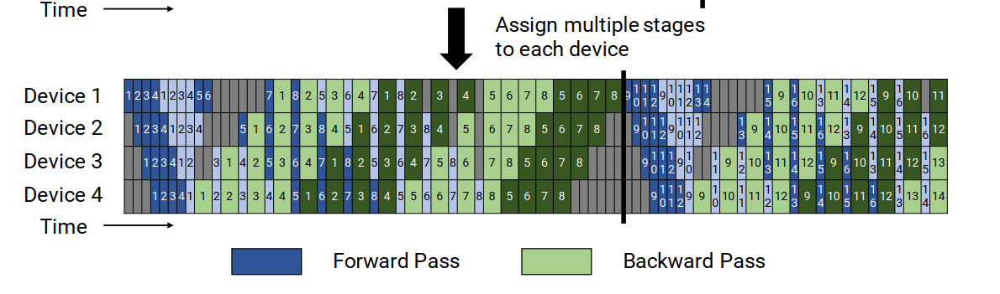

​	思路：为了减小pipeline bubble的大小，每个设备可以执行多个子层集合（模型块）的计算，而不是单一的连续子层集合。这样，流水线中的每个设备就被分配了多个stage，所以每个stage有更少的计算。

​	该调度仍采用1F1B，一个batch中的micro batches数应该是流水线并行度的整数倍。

对于相同的batch size，流水线刷新更快：每个设备有 v 个stage

对于一个microbatch，前向传播和反向传播的时间分别为：$\frac {t_f}{v}$  $\frac {t_b}{v}$

$t_{pb} = \frac{(p - 1) * (t_f + t_b)}{v}$

$t_{id} = m * (t_f + t_b)$

Bubble  time fraction(pipeline bubble size)$ = \frac{t_{pb}}{t_{id}} = \frac1 v * \frac{p - 1}{m}$

Bubble time减少至原来的 v 倍，但会带来额外 v 倍的通信量。

### Weak scaling

使用weak scaling setup，去评估默认非交错流水线并行调度的scale性能。

随着增加pipeline stage数，通过成比例的增加模型中的层数，来增大模型大小。对于所有的设置都使用大小为8的TP。

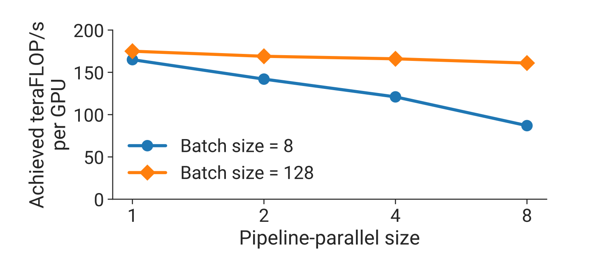

由结果可知，对于更大的batch size，scale效果更好。因为随着stage增大，pipeline bubble也变大，但对于更大的batch size，pipeline bubble会分摊在更多的microbatch中。

### Interleaved versus Non-Interleaved Schedule

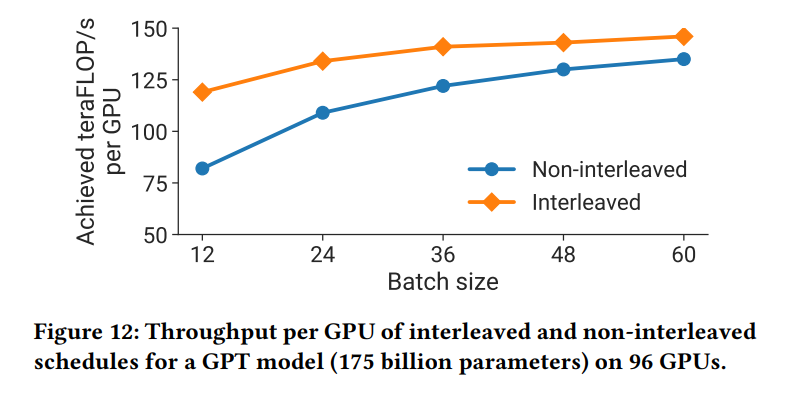

带有scatter/gather通信优化的 interleaved schedule 比 non-interleaved schedule 的效果更好，但它们之间的差别会随着batch size的增大而减小，有两个原因：

1. 随着batch size的增大，default schedule的pipeline bubble 减小
2. pipeline中的点对点通信量正比于batch size，由于interleaved schedule 每个microbatch有更多的通信量，所以default schedule随着通信量的增加会逐渐缩小差距

如果没有scatter/gather通信优化，在更大的batch size时，non- interleaved schedule 比 interleaved schedule 的效果更好。

## Performance Analysis of Parallelization Configurations

不同并行策略之间的权衡

### Notation

(p, t, d) : 并行化维度	n : GPU数	B : global batch size	b : microbatch size

$m = \frac1b * \frac Bd$ : 每个流水线中一个batch的microbatch数

### Tensor and Pipeline Model Parallelism

假设 d = 1，所以  $pipeline\,bubble\,size=\frac{p - 1}{m} = \frac{n/t-1}{m}$

对于固定的B, b, d，则m也固定。随着t增大，pipeline bubble变小。

根据p和t的不同，通信量也会有所不同。PP是成本较低的点对点通信，而TP需要all_reduce通信操作。在PP中，对于每个microbatch，在每对连续设备的前向传播和反向传播需要的通信量是 $bsh$ 。在TP中，对于每个microbatch，在每个设备的每一层中，大小为$bsh$ 的数据需要在前向传播和反向传播中各all_reduce两次，所以总的通信量为  $$l^{stage} * （8bsh(\frac{t-1}{t}))$$ 。

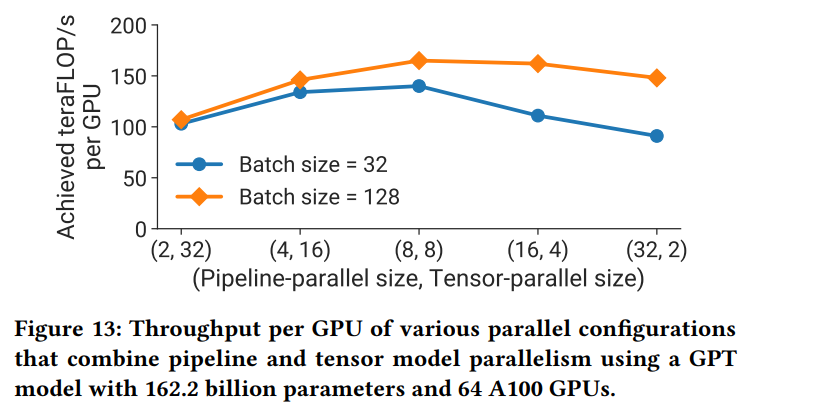

TP最好在一个服务器中。PP中较多时间花费在pipeline bubble中，所以应该限制PP的stage数，以便micro batch数是stage数的合理的倍数。

**总结1**：在考虑不同形式的MP时，当使用g个GPU的服务器时，TP度应该为g，PP可以跨服务器扩展到更大的模型。

### Data and Pipeline Model Parallelism

设 t = 1，每个流水线的microbatches数是  $m = \frac{B}{d*b} = \frac{b^`}{d}$ ，

其中$$b^` = \frac Bb$$，$p = \frac nd$

$pipeline\,bubble\,size = \frac{p-1}{m} = \frac{n/d-1}{b^`/d} = \frac{n-d}{b^`}$

所以 d 越大，bubble size越小。ring all_reduce的通信时间是$\frac{(d-1)V}{d\beta}$ （V是通信量，$\beta$ 是带宽），所以通信时间随d的缩放率是$\frac {d-1}{d}$ 。所以尽管随着d的增大，通信时间会增大，但不会随着d剧烈增大，总的吞吐量最终是会变大的。

对于给定的并行化配置，提高batch size大小B，$b^`$会增大，导致m变大，因此bubble size会减小。同时，数据并行所需的all_reduce操作会变少，吞吐量会进一步增大。

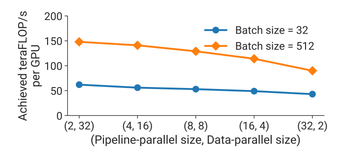

随着PP的增大，吞吐量会减小（随着DP的增大，吞吐量会增大）。所以PP应该主要用于支持单个设备放不下的模型，而DP用于扩大训练规模。

### Data and Tensor Model Parallelism

跨服务器执行all_reduce操作成本非常高。TP需要对每个microbatch执行all_reduce操作，而DP只需要对每个batch执行all_reduce操作。除此之外，每个TP进程只执行一个层的计算子集，效率较低。

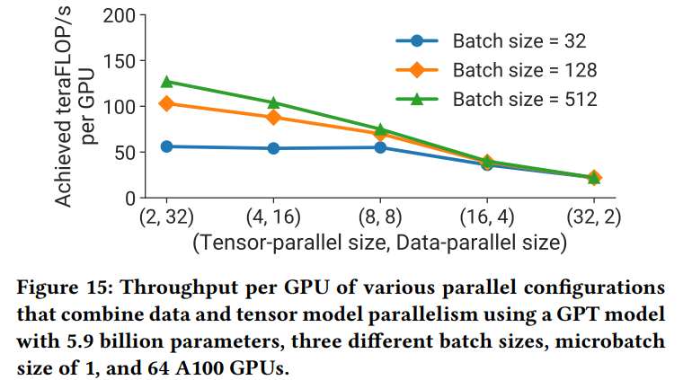

batch size越大，DP的数据通信会减少（因为需要通信的batch数减少）。

**总结2**：在使用数据并行和模型并行时，应该使用使模型参数和中间值能够存到GPU内存中的模型并行数M = t * p，然后用数据并行把模型训练扩展到更多的GPU上。 

### Microbatch Size

给定并行化配置（p，t，d）和batch size大小B的情况下，确定最优的microbatch size大小b。

不论b的大小是什么，DP的通信量是不变的。

函数$t_f(b)$  $t_b(b)$  大小为b的microbatch前向传播和反向传播计算所需的时间，那么计算一个batch所需要的总时间为：$(b^`/d + p - 1)*(t_f(b) + t_b(b))$

b通过改变m来影响bubble size，同时也会影响算数强度。

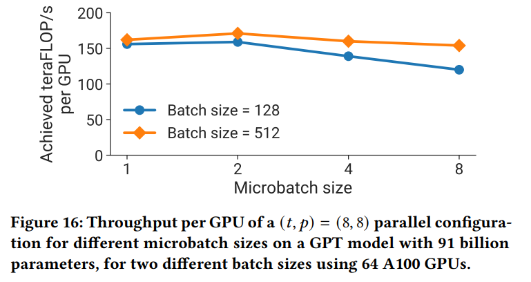

**总结3**：最佳的microbatch大小b，取决于模型吞吐量、内存占用、流水线p、DP度d和batch size大小B。

### Activation Recomputation

activation checkpoints的数量不会影响吞吐量，但会影响内存占用。

A~input~ 是一个层的input size，A~intermediate~ 是一个层的中间激活值大小，一个model stage 有 l 个层，有c个checkpoints，那么总的内存占用是：$c*A_{input} + l/c*A^{intermediate}$，当$c = \sqrt{l*(A^{intermediate}/A^{input})}$ 时，内存占用最小。通常情况下，每1～2个transformer layers 去checkpoint是最优的。

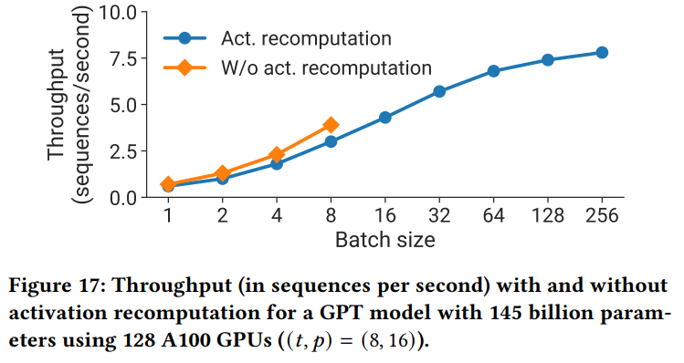

对于小的batch size，由于反向传播前的激活重计算，会导致一个比较低的吞吐量；但是使用了激活重计算，就可以使用较大的batch size，这可以减小bubble size，从而提升吞吐量。

## Implementation

### Communication Optimizations

可以使用TP和PP，去减少跨节点间通信开销。

每个 DGX A100 都配备了 8 个 InfiniBand （IB） 网卡。但是pipeline中的send和receive都是点对点通信，只能在两个GPU间进行通信，所以在pipeline中就不能有效的利用8个网卡去进行通信。

在不同的TP进程中，每个对应的transformer layer都会有相同的重复的输出，这就会导致多个进程在相邻的两个流水线stage间send和receive相同的tensor。为了消除这些冗余，可以在发送侧把tensor切割成相同的块，然后每个进程使用自己的网卡将对应块发送给下一个stage相应的进程。然后在接受侧使用all_gather去得到完整的tensor，因为TP一般在同一个服务器中，传输数据更快。将这个称为 scatter/gather communication optimization。

通过这个优化，每对连续stage之间的通信量减少为$\frac{bsh}t$

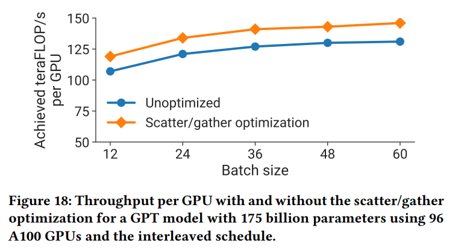

### Computation Optimizations

对计算图实现三种特定于模型的优化，以此来实现高性能：

1. 改变transformer layer的数据布局，来避免memory- intensive转置操作，并支持使用跨batch矩阵乘法内核（strides batched GEMM kernels）：将数据布局从[b，s，a，h]改为[s，b，a，h]。
2. 为一系列元素操作生成融合内核（bias + GeLU    bias + dropout + add）。
3. 实现两个自定义内核使得能够融合scale、mask、softmax(reduction)操作：一个支持常规masking（在BERT中使用的）；另一个支持implicit causal masking（在类似于GPT的自回归模型中使用）。

## Evaluation

### Comparison to ZeRO-3

由于PTD-P比ZeRO-3有更少的跨节点间通信，所以PTD- P会更优。
