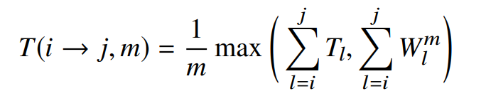
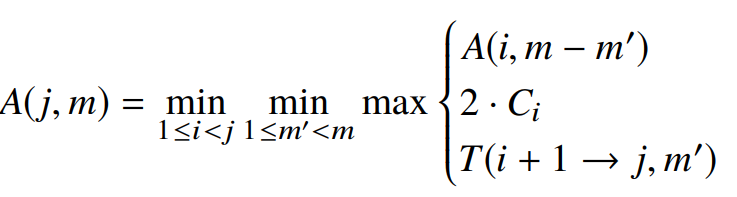
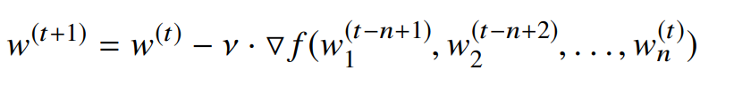
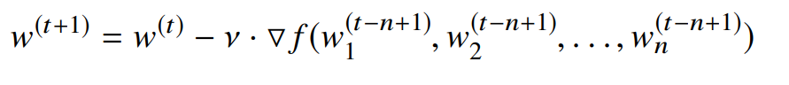

# Pipeline parallelism

## Contributions

- 减少总训练时间中的通信占比（解决了 DP 中的通信消耗瓶颈问题）

**与 DP 相比的优势** 

1、 通信量更少（只需要通信某几层的输出）

2、 通信和计算重叠（激活值和梯度的异步通信）

**怎么做到**

- 通信和计算是同时进行的
- 自动划分 stage（通过profile阶段的分析，在最大限度减少通信的同时，平衡不同stage之间的计算负载）
- 在一些stage上使用DP，为了平衡计算负载
- 交替进行前向计算和反向计算（不会一直做前向，使模型收敛）
- 交替进行前向和反向，需要处理前向和反向的参数版本

**数据并行** 

1、 通信量与模型大小成正比，模型变得越来越大，训练的大部分时间都用来通信

2、 GPU迭代更新，计算变得更快，使计算通信比变低

**模型并行** 

1、 不能有效切割模型（有强化学习算法去做，但是费时间费资源）

2、 一次只能做一部分计算（去做流水线，一是比较难，二是有前向和反向计算有参数版本不匹配问题）

## Method

有三个问题需要解决：

1、 根据GPU数，怎么有效的将模型划分为多个stage

2、 在保证有效学习的情况下，怎么调度计算

3、 在异步通信的情况下，怎么做到有效学习

### 划分 stage

**需要考虑两点** 

1. 每个stage大概有相同的工作量
2. stage之间的通信量尽可能的少

**method** 

1. 在一个机器上profile模型
2. 运行partitioning algorithm去切割模型（怎么切割模型，每个stage的DP数）

#### profile

​	需要记录每一层的三个值：

- T~l~ ：这一层前向传播和反向传播的总计算时间
- a~l~ ：这一层 输出激活 和 输入梯度 的大小
- w~l~ ：这一层的参数量

使用 a~l~ 来计算 C~l~  ：层 l 和 层 l+1通信所需要的时间

W~l~^m^  ：使用m台机器进行DP，并使用分布式参数服务器时，同步层l 的参数所需要的时间（使用w~l~ 估计）

#### Partitioning Algorithm

需要确定三件事：

1. 怎么划分stage
2. 每个stage的DP数
3. 确定使吞吐量最大的minibatch数

最小化总体运行时间，等价于最小化最慢的stage的时间，有最优子问题属性，用动态规划求解

子问题个数为O(NM)，每个子问题的复杂度为O(NM)，所以总的时间复杂度为O(N^2^M^2^)

让流水线处于满载状态的minibatch数：[ (#machines) / (#machines in the input stage)] = NUM_OPT_ACTIVE_MINIBATCHRS(NOAM)

### 计算调度

​	做太多前向计算，而反向传播较少，会阻碍模型学习，收敛时间变长

​	做一个batch的前向，就开始计算反向，会使机器处于空转状态

pi pedream的调度方案：

​	输入NOAM个minibatch，一旦处于稳定状态，每个stage交替执行前向计算和反向计算。处于稳定状态后，没有stage处于空转状态。（one-forward-one-backward  1F1B）

​	<u>对于使用了DP的stage，使用 确定性轮询负载均衡方案 ，把上一stage的输出，均衡负载到该stage上。（minibatchID mod stageReplicaID）可以确保machine对相同的minibatch做前向和反向。</u>

**代价** ：使用了异步通信，这就带来了有效学习的问题（会遇到前向传播和反向传播所用的参数版本不匹配问题）

​	会带来 **负载不均衡** 问题，越靠前的stage，需要保存越多的激活值

### 有效学习

**直接使用1F1B会有两个问题** ：

1. 同一stage的同一minibatch，前向和反向会使用不同版本的参数
2. 不同stage的同一minibatch，会使用不同的参数版本

​	不利于模型收敛

**weight stashing** 

做前向计算时，每个minibatch会用该stage最新版本的参数，并把参数作为中间值进行保存。

做反向计算时，取出对应版本的参数去计算梯度。

只能保证在一个stage内，前向计算和反向计算使用相同版本的参数，但是不同stage的参数版本还是不一致的。

**vertical sync** 

来解决各stage所用参数版本不一致问题，每个stage都用input stage 中最新的参数版本，相应的信息与激活值和梯度一起传递。

**weight stashing 是比较重要的，vertical sync的作用可以忽略，所以weight stashing是默认设置**

<u>**代价** ：需要多个minibatch才能进行一次有效学习，会使收敛变慢</u>

### GPU内存处理

根据每层的参数，计算出 输入，权重，中间值所需的内存大小（每个stage是不一样的）。在训练开始时，分配相应的内存大小，并在之后的过程中重复利用这些内存。

# 